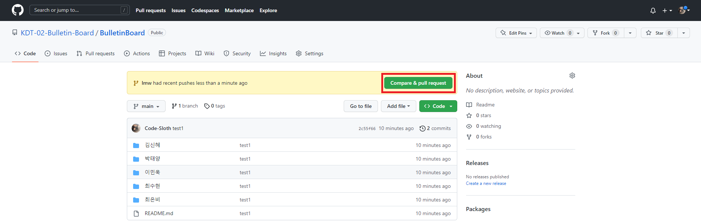
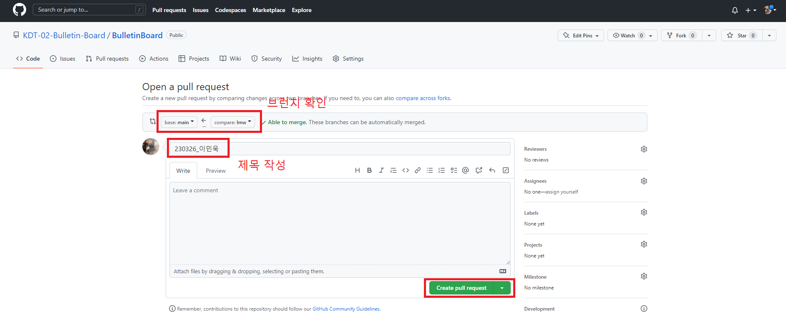
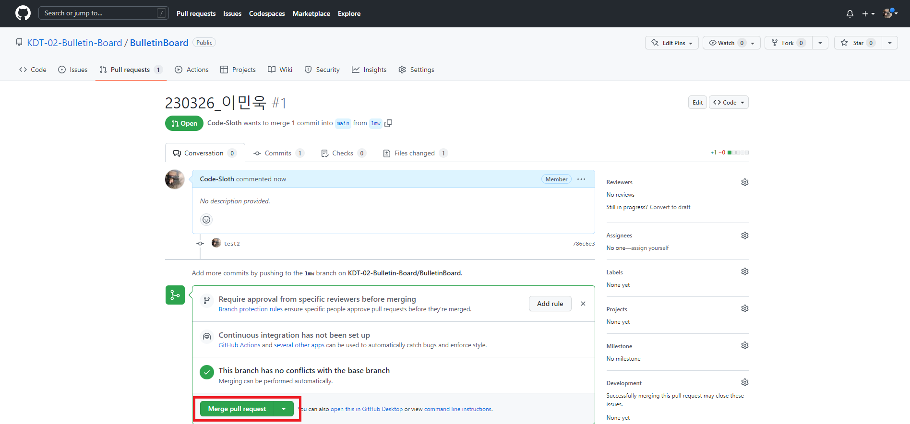

# PR Guide

<br/>

## ✅ 사전 작업

<br/>

1. clone을 받지 않았으면 받는다.

```
git clone https://github.com/KDT-02-Bulletin-Board/BulletinBoard.git
```

<br/>

2. 작업 브런치를 생성 및 변경한다

```
git branch 이름 (ex lmw)
git checkout 방금 생성한 브런치
```

<br/>

## ✅ 게시판 작업 시작

<br/>

- 메인 브런치의 최신 내용을 가져온다

```
git checkout main
git pull origin main
git checkout [자신이 생성한 브런치 이름]
git merge main
```

<br/>

## ✅ 게시판 작업 후

<br/>

- 작업 내용을 commit and push (자신의 브런치에서 push)

```
git status // 변경사항 확인
git add .
git commit -m "현재 날짜_이름"
git push origin 자신이 생성한 브런치 이름 (ex lmw)
```

<br/>

## 🔥 Pull Requests

<br/>
<br/>



- Compare & pull request

<br/>
<br/>



- 브런치 확인
  - base : main
  - compare : 자신이 생성한 브런치 이름
- Create pull request

<br/>
<br/>



- Merge pull request
